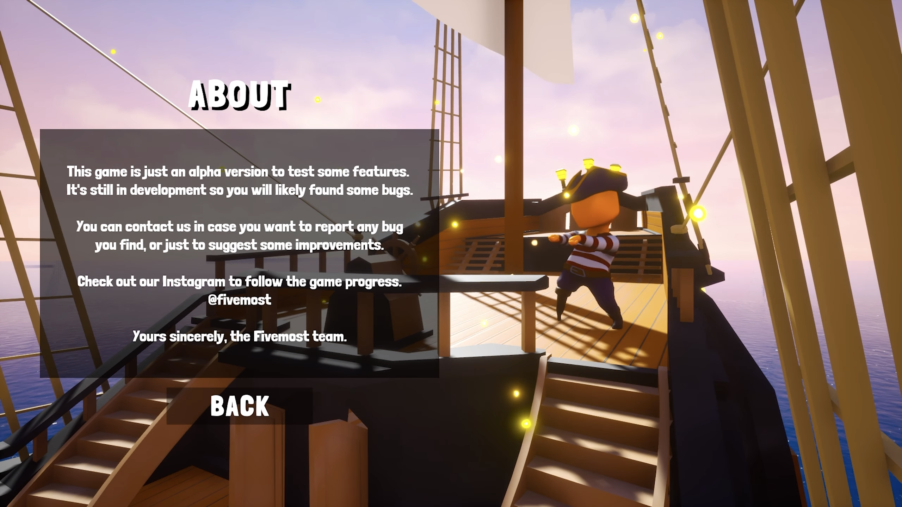

  <h1>🏴‍☠ Pirateland</h1>
  

  

  📥 <a href="https://fivemost.itch.io/pirateland">Download</a>
  &nbsp;·&nbsp;
  🔑 <a href="https://github.com/iivvaannxx/pirateland?tab=License-1-ov-file">License</a>

  

  
<em><b>A pirate-themed game packed with exciting minigames on the high seas. </b></em>

  

    
    
  

> [!IMPORTANT]
> This repository is only a showcase of the game. It provides the links to download the game and information about it. The game is not open-source and the source code is not available, primarily due to the use of assets which license does not allow redistribution. The game is built using Unreal Engine.

> [!NOTE]
> Although it's indicated in the itch.io page (and probably somewhere else), that the game will be developed further, it's not the case. We didn't have the time to continue it, although we really wanted to. Hope you enjoy the game as it is.

## 🛠️ How to Play

The game is available on the [itch.io page](https://fivemost.itch.io/pirateland) we created for our group. You can download it from there. After downloading it, extract the files and run the executable file, you don't need to install anything else.

## 🎮 Controls

## 📜 License

Pirateland © 2022 by Fivemost is licensed under CC BY-NC-ND 4.0. To view the details of this license, visit this link.

## 📷 Screenshots

