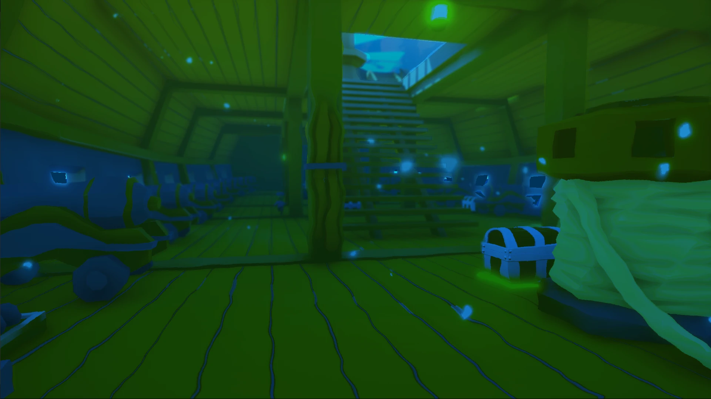

  <h1>🏴‍☠ Pirateland</h1>
  

  

  📥 <a href="https://fivemost.itch.io/pirateland">Download</a>
  &nbsp;·&nbsp;
  🔑 <a href="https://github.com/iivvaannxx/pirateland?tab=License-1-ov-file">License</a>

  

  
<em><b>A pirate-themed game packed with exciting minigames on the high seas. </b></em>

  

    
    
  

> [!IMPORTANT]
> This repository is only a showcase of the game. It provides the links to download the game and information about it. The game is not open-source and the source code is not available, primarily due to the use of assets which license does not allow redistribution. The game is built using Unreal Engine.

## 📖 Introduction

Pirateland is a pirate-themed game developed by a team I was part of (Fivemost), as a project for a college subject where we were tasked to develop a game using Unreal Engine. The game consists of 4 different minigames, each with its own objective and mechanics. 

Due to the time constraints, some parts of the game stayed unfinished or in the prototype stage. However, the game is fully playable and enjoyable. It was developed primarily with Blueprints, Unreal Engine's visual scripting system, and C++ for some other parts of the game.

> [!NOTE]
> Although it's indicated in the itch.io page (and probably somewhere else), that the game will be developed further, it's not the case. We didn't have the time to continue it, although we really wanted to. Hope you enjoy the game as it is.

## 🛠️ How to Play

The game is available on the [itch.io page](https://fivemost.itch.io/pirateland) we created for our group. You can download it from there. After downloading it, extract the files and run the executable file, you don't need to install anything else.

## 🎮 Minigames

The game consists of 4 different minigames. Here is a brief explanation of each of them:

### Treasure Finder

Like a good pirate, you have attacked an enemy ship, and your objective is to reach the golden treasure and to steal as many small treasures as you can. But be careful, the ship is damaged and it will progressively sink. There are some enemies around the ship, but they are so scared that they won't attack you. They are just running for their lives!

> [!TIP]
> As a support mechanic, if you attack and hit an enemy, the ship will stop going down for 5 seconds.

#### Controls

In order to collect a treasure, you have to **attack** it. The controls are as follows:

- **Movement**: `W`, `A`, `S`, `D`
- **Jump**: `Space`
- **Attack**: `Left Mouse Button`

### Rolling Barrels

A good pirate's objective should always be to find the treasure, that's why you have 1 minute and 20 seconds to reach the final platform and obtain your reward. 

You have three lanes, the middle one is the fastest but the hardest too. Be careful with the barrels because some of them are moving and rotating. If you fall into the water you will respawn at the last checkpoint achieved. Caution! There are cannons that will shoot a cannonball that will push you out of the platforms, dodge them!

> [!TIP]
> Just at the very beginning, in the center lane, there's a golden barrel that can catapult you straight to end of the level. It's difficult, but it can be done. Use it if your time is running out.

#### Controls

- **Movement**: `W`, `A`, `S`, `D`
- **Jump**: `Space`

### Obstacle Race

The objective of this minigame is to reach the end of the course as fast as you can. You will have to overcome all the platforms and obstacles in order to reach the treasure that will make you rich. If you fall into the water you will respawn at the last checkpoint achieved. If you hear a bell, it means you just crossed a checkpoint.

#### Controls

- **Movement**: `W`, `A`, `S`, `D`
- **Jump**: `Space`

### Cannon Race

You're located at a vast archipelago of islands, and you spotted an enemy ship at the horizon with a super valuable treasure. You have to reach the ship before the time runs out. Use your cannon to shoot yourself between the islands and reach the ship. If you fall into the water, you will respawn at the latest island you reached.

> [!TIP]
> The nearest islands are bigger, so it's easier to fall on those. If you want to go faster, aim for the smaller islands.

#### Controls

- **Aim**: `Mouse`
- **Shoot**: Keep the `Left Mouse Button` pressed and regulate the power of the shot by moving the mouse up and down (there's an indicator), release the button to shoot.

## 📜 License

Pirateland © 2021 by Fivemost is licensed under CC BY-NC-ND 4.0. To view the details of this license, visit this link.

## 📷 Screenshots

